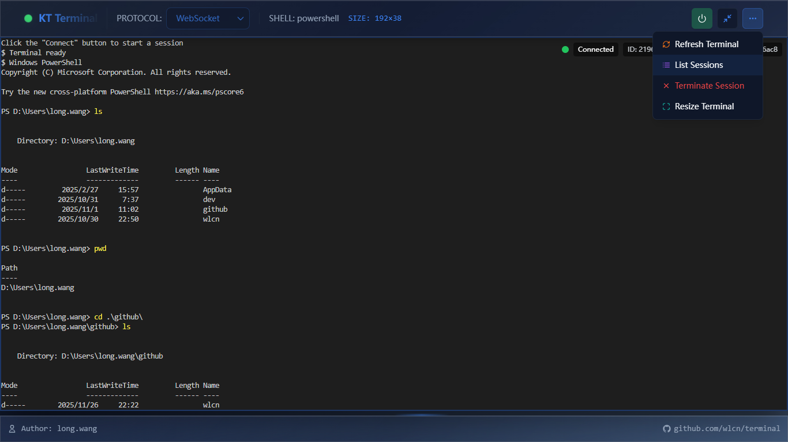

# KT Terminal - 现代化Web终端平台

## 🚀 项目简介

基于现代技术栈构建的高性能Web终端应用平台，支持WebSocket实时通信协议，提供终端会话管理和实时终端操作。项目同时提供Kotlin和Rust两种后端实现，满足不同部署需求。

## 🎬 快速演示


## 🏗️ 核心架构

### 技术栈

#### 后端
- **Kotlin实现**: Kotlin + Ktor + Virtual Threads
- **Rust实现**: Rust + Axum + Tokio

#### 前端
- React + TypeScript + Tailwind CSS
- 基于Vite构建，支持热重载

### 项目结构
```
terminal/
├── kt-terminal/           # Kotlin后端实现
│   ├── applications/      # 应用入口
│   ├── bounded-contexts/  # 业务领域模块
│   ├── shared-kernel/     # 共享内核
│   └── infrastructure/    # 基础设施
├── rs-terminal/           # Rust后端实现
│   ├── src/               # Rust源码
│   ├── Cargo.toml         # Cargo配置
│   └── application.toml   # 应用配置
└── clients/               # 前端项目
    └── web-terminal/      # React + TypeScript + Tailwind CSS
```

## 📦 模块说明

### 前端项目
- **web-terminal**: 现代化Web终端界面
  - 支持WebSocket通信协议
  - 基于Vite构建，支持热重载
  - 现代化UI设计，简洁高效
  - 响应式布局，适配不同屏幕尺寸

### 后端实现

#### Kotlin后端 (kt-terminal)
- **terminal-session**: 终端会话管理
- **file-transfer**: 文件传输功能
- **collaboration**: 协作终端
- **audit-logging**: 审计日志

#### Rust后端 (rs-terminal)
- **http_server**: HTTP API服务，兼容kt-terminal接口
- **session**: 会话管理
- **terminal**: 终端PTY处理
- **transport**: 通信协议支持
  - **websocket**: WebSocket协议实现
  - **webtransport**: WebTransport协议支持（开发中）
- **terminal_service**: 核心终端服务逻辑

## 🚀 快速开始

### 前端启动
```bash
cd clients/web-terminal
pnpm install
pnpm dev
```

### 后端启动 (选择其一)

#### Kotlin后端
```bash
cd kt-terminal/applications/ktor-application
./gradlew run
```

#### Rust后端
```bash
cd rs-terminal
cargo run
```

## 📖 核心特性

- **WebSocket支持**: 高效的实时数据传输
- **高性能终端**: 基于PTY的伪终端实现，低延迟
# KT Terminal - 现代化Web终端平台

## 🚀 项目简介
基于现代技术栈构建的高性能Web终端应用平台，支持WebSocket实时通信协议，提供终端会话管理和实时终端操作。项目同时提供Kotlin和Rust两种后端实现，满足不同部署需求。

## 🎬 快速演示


## 🏗️ 核心架构
...- **交互式命令处理**: 完整的终端命令输入输出流程
- **会话管理**: 支持终端会话的创建、查询和终止
- **双后端实现**: Kotlin和Rust两种后端可选
- **现代化架构**: 采用DDD和Clean Architecture设计原则
- **配置化管理**: 支持TOML配置文件

## 🔧 开发指南

### 架构原则
- 领域驱动设计（DDD）
- 事件驱动架构
- 模块化设计
- 依赖倒置原则
- 协议适配器模式

### 通信协议

#### WebSocket
- 默认端口: 8081
- 路径格式: `ws://localhost:8081/ws/{session_id}`
- 纯文本传输，简单高效

#### WebTransport（开发中）
- 目标: 支持基于HTTP3/QUIC的WebTransport协议
- 预期特性: 更低的延迟和更高的吞吐量

### 交互式命令实现

#### 命令处理流程
```
┌─────────────────┐     ┌─────────────────┐     ┌─────────────────┐
│   前端浏览器    │     │   后端服务器    │     │   终端进程      │
└────────┬────────┘     └────────┬────────┘     └────────┬────────┘
         │                        │                        │
         │ 1. 用户输入命令         │                        │
         │───────────────────────>│                        │
         │                        │                        │
         │                        │ 2. 转发命令到PTY       │
         │                        │───────────────────────>│
         │                        │                        │
         │                        │ 3. 执行命令            │
         │                        │                        │
         │                        │ 4. 捕获命令输出        │
         │                        │<───────────────────────│
         │                        │                        │
         │ 5. 返回输出到前端       │                        │
         │<───────────────────────│                        │
         │                        │                        │
         │ 6. 渲染终端输出        │                        │
         │                        │                        │
┌────────┴────────┐     ┌────────┴────────┐     ┌────────┴────────┐
│   前端浏览器    │     │   后端服务器    │     │   终端进程      │
└─────────────────┘     └─────────────────┘     └─────────────────┘
```

#### 核心组件

1. **前端终端组件**
   - 捕获用户键盘输入
   - 渲染终端输出
   - 管理终端状态和尺寸
   - 建立和维护WebSocket连接

2. **通信层**
   - WebSocket协议适配器
   - 纯文本消息传输
   - 实时双向通信
   - 连接状态管理

3. **会话管理**
   - 会话创建和销毁
   - 终端进程关联
   - 客户端连接管理
   - 并发会话支持

4. **终端服务**
   - PTY进程创建和管理
   - 命令输入转发
   - 终端输出捕获
   - 终端尺寸调整
   - 进程终止

5. **PTY集成**
   - 跨平台PTY支持
   - 标准输入输出处理
   - 终端环境配置
   - 进程生命周期管理

#### 技术实现

- **命令输入处理**: 前端捕获键盘事件，转换为终端输入序列，通过WebSocket发送到后端
- **PTY交互**: 后端将输入写入PTY标准输入，捕获PTY标准输出和标准错误
- **输出转发**: 后端将PTY输出实时通过WebSocket发送回前端
- **终端同步**: 保持前端终端尺寸与后端PTY尺寸一致
- **错误处理**: 完整的错误捕获和传递机制


### 代码规范

#### Kotlin
- 充分利用语言特性
- 不可变数据类
- 函数式编程风格
- 测试驱动开发

#### Rust
- 遵循Rust最佳实践
- 异步编程优先
- 线程安全设计
- 清晰的错误处理

## 📋 API接口

### 会话管理
- `POST /api/sessions`: 创建新会话
- `GET /api/sessions`: 列出所有会话
- `GET /api/sessions/{session_id}`: 获取会话详情
- `DELETE /api/sessions/{session_id}`: 终止会话
- `PUT /api/sessions/{session_id}/resize`: 调整终端大小

### 终端通信
- WebSocket: `ws://localhost:8081/ws/{session_id}`

## 📝 配置说明

### Rust后端配置
配置文件: `rs-terminal/application.toml`

```toml
[http]
port = 8080

[websocket]
port = 8081

[webtransport]
port = 8082

[shell]
program = "bash"
args = ["-l"]
```

## 🤝 贡献指南

欢迎提交Issue和Pull Request！

## 📄 许可证

MIT License